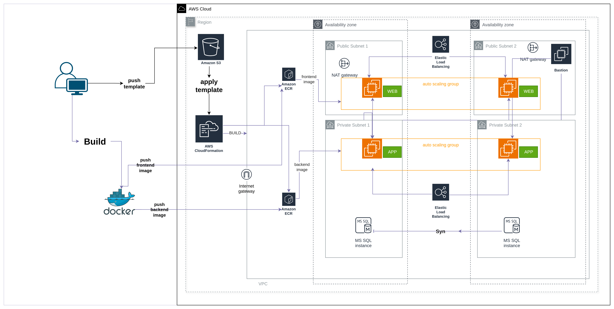

#  AWS CloudFormation – App Demo Infrastructure

##  Project Architecture

> A visual representation of the deployed infrastructure (VPC, Subnets, Load Balancer, EC2, RDS, and Auto Scaling).

---

##  Project Demo
 Watch the demo video:  
[Click here to view the video](myapp-infra/videos/video.mp4)

---

##  Project Overview
This project automates the deployment of a **complete 3-tier infrastructure** using **AWS CloudFormation**.  
The stack is designed for scalability, high availability, and automation.

### Components
- **VPC** with public and private subnets  
- **Security Groups** for secure network isolation  
- **Bastion Host** for SSH access to private instances  
- **Application & Web Load Balancers**  
- **Launch Templates** with Docker setup  
- **Auto Scaling Groups** for dynamic scaling  
- **RDS Database** in private subnets  
- **Docker containers** automatically launched on EC2 instances  

---

##  How It Works
1. **Database Stack** – Creates the RDS instance inside private subnets.  
2. **Compute Stack** –  
   - Deploys a Bastion Host in the public subnet.  
   - Creates Application and Web Load Balancers.  
   - Launches EC2 instances with Docker pre-installed.  
   - Links instances to Target Groups and Auto Scaling Groups.  
3. **Root Stack** – Integrates both stacks to form a complete infrastructure setup.

---

##  Tech Stack
- AWS CloudFormation  
- Amazon EC2  
- Elastic Load Balancer (Classic + ALB)  
- Auto Scaling Groups  
- Amazon RDS  
- Docker  
- ubuntu  

---

##  Deployment Instructions
```bash
git clone https://github.com/Ahmedaboalnader/Cloudformation.git
cd Cloudformation/myapp-infra

aws cloudformation create-stack \
  --stack-name myapp-root-stack \
  --template-body file://myapp-root-stack.yaml \
  --parameters ParameterKey=KeyName,ParameterValue=your-key \
  --capabilities CAPABILITY_NAMED_IAM \
  --region us-east-1
